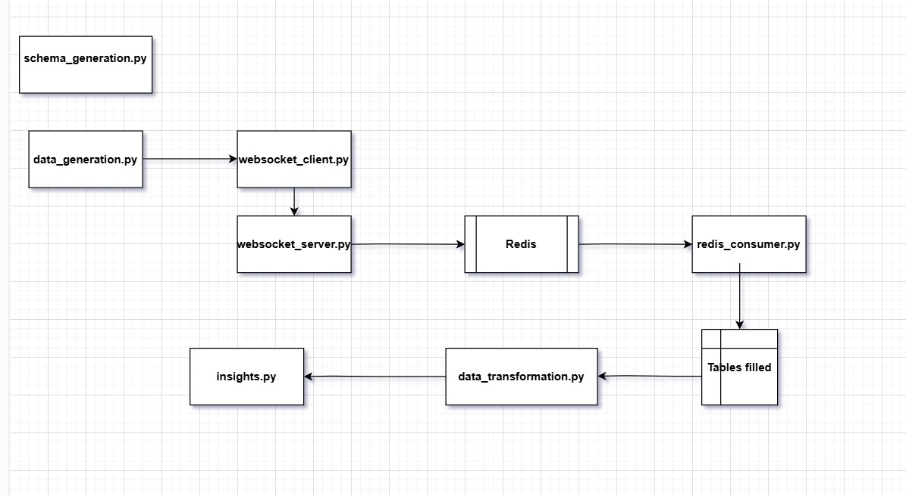

# liquid_duck
Liquid Duck Project

The assignment can be divided into the following tasks:
- Data set Creation
- Data Preprocessing loading
- Data transformation in duckdb using grouping sets, pivot, unpivot
- Redis stream implementation

  Schema of the initial source tables:
  Schema:

Sales:
	- Sale_id
	- Product_id
	- Customer_id
	- Sale_date
	- Sale_volume
	- Sale_revenue
	
Product:
	- Product_id
	- Supplier
	- Brand
	- Family
	- Product_name
	- Product_cost
	- Inventory_volume
	
Customer:
	- Customer_id
	- Customer_name
	- Customer_address
	- Customer_phone

Workflow:

**Schema Generation:**
Sales, Products, Customers table are created and a denormalized and Grouping Sets views are created.
We have used views instead of tables, to get the latest data every time we run a query.

**Data Generation:**
I have used Faker library for creating dataset. 3 datatsets representing Sales, Products and Customers were created and saved in csv files.

**Real time data simulation using Tornado Websocket Server and Redis:**
To simulate streaming data from a websocket client, the websocket client takes data from the csv files and sends it to the websocket-server.
The websocket-server receives the data and pushes the data to the Redis stream. Redis-consumer consumes from the redis queue and inserts the data to the appropriate tables.

**Data Transformation:**
The Grouping set and Pivot views are created for Total revenue and Total sales.

